# Layout study 03 — Netflix, bands and the dial

**Live:** https://gregoryedgerton.github.io/golden-grids-study-03-netflix/

An unaffiliated layout study. It rebuilds the structure of two named pages
using stacked golden grids, then opens one title into its own frames on the
spiral dial. The imagery is stills from films in the public domain in the
United States; the copy is original. Nothing from the
reference site — photography, wordmarks, marketing copy — is reproduced.

Built with [Golden Grids](https://github.com/gregoryedgerton/golden-grids)
([npm](https://www.npmjs.com/package/@gifcommit/golden-grids) ·
[generator](https://gregoryedgerton.github.io/golden-grids/)), from the
[study template](https://github.com/gregoryedgerton/golden-grids-study-template).

> **Status: built and live; typography, expansion and schemes brought to Study 04's standard 2026-10-06.** Structure measured at three widths, visual
> register matched to tokens measured from the reference, and every image a
> still from its film: Nosferatu and ten more of Weimar-era German cinema,
> all public domain in the United States. [`ASSETS.md`](ASSETS.md) is the
> provenance and the rights table. The standfirst and synopsis are drafts.
> What remains is the written post.

---

## Reference

**Pages:** the signed-out netflix.com home page — https://www.netflix.com/ —
and a signed-out title page — https://www.netflix.com/title/80240715.

**Captured:** 2026-10-05, signed out, en-US, at 390 / 820 / 1440, with
[`captures/capture.cjs`](captures/capture.cjs). Each capture has a `.json`
beside it holding the page's headings and the measured boxes of its row
tiles; the inventory below is read from those, not from memory.

| Width | Reference (home) | Reference (title) | Study (reduced motion) | Study (dial, mid-travel) |
| --- | --- | --- | --- | --- |
| 390px | 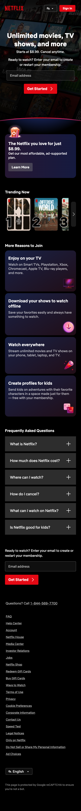 | 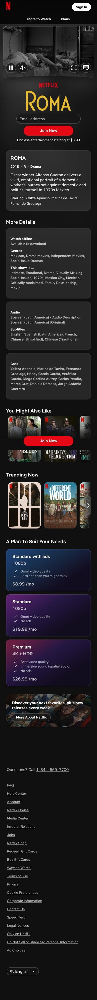 | 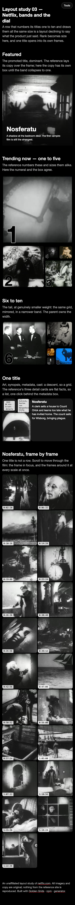 | 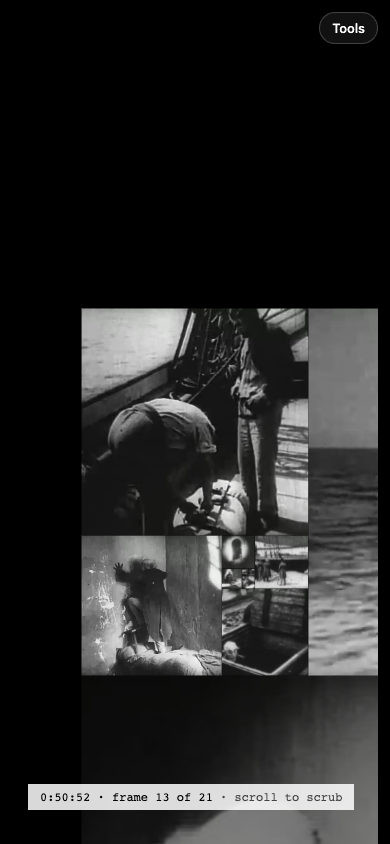 |
| 820px | 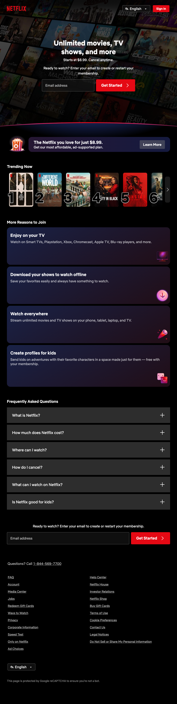 | 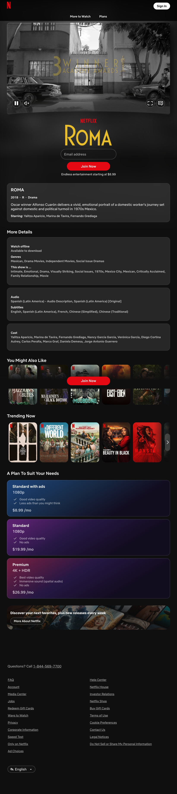 | 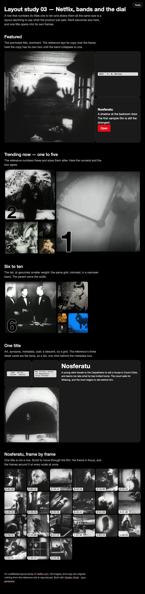 | 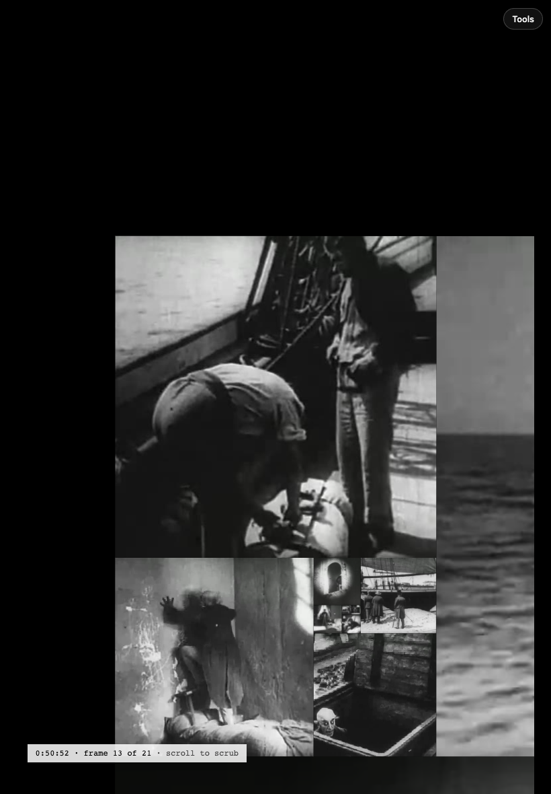 |
| 1440px | 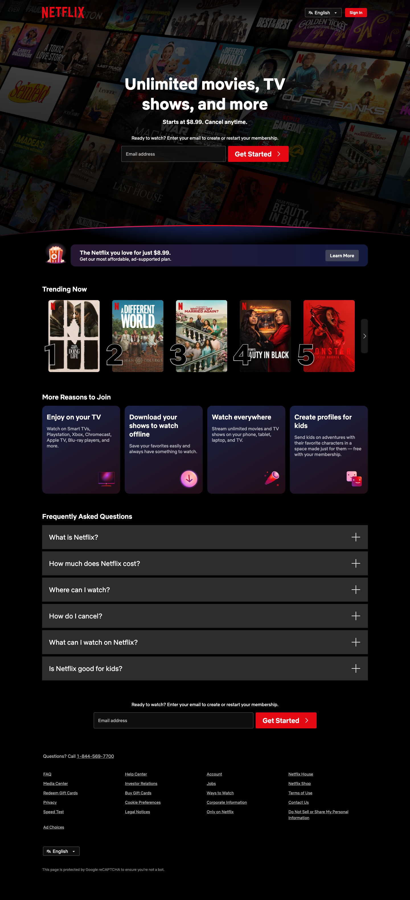 | 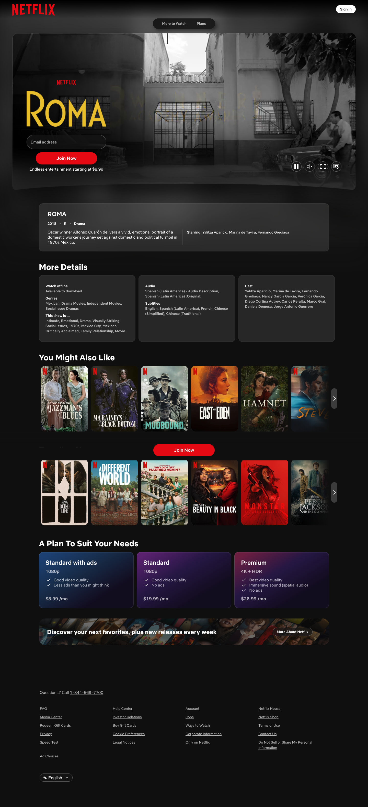 | 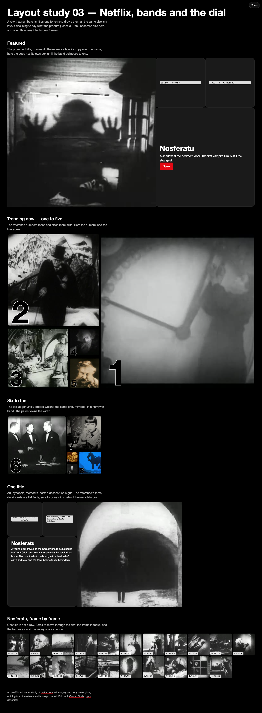 | 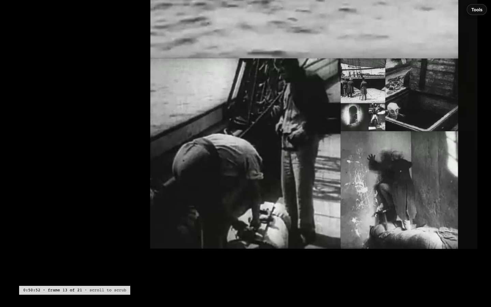 |

### What the brief got wrong

The brief names "the netflix.com browse homepage". Signed out,
`netflix.com/browse` redirects to the login form, so the signed-in browse
page — the billboard and its rows of carousels — was **not captured and is
not what this study rebuilds**. The live page wins:

- The signed-out home page is a sign-up page with exactly one content row,
  *Trending Now*. That row is a better subject than the brief's: it prints a
  rank numeral from 1 to 10 beside each tile and draws all ten tiles the same
  size. The page states a hierarchy in type and withholds it in layout.
- The signed-out title page carries the billboard the brief expected on
  browse, plus a details card, three *More Details* cards, two rows, and a
  three-plan price table.

The signed-in browse page is **out of scope by decision** (Greg,
2026-10-05). Nothing here assumes what it looks like, and the post must not
argue about it.

## The claim

A row that numbers its titles one to ten and draws them all the same size is
a layout declining to say what the product just said.

And the reconciling claim the program needs from this study: **bands suit
many titles and the dial suits one.** A ranking is a hierarchy across
different things, so it wants boxes of different sizes standing still. A film
is one thing with an inside, so it wants a way of moving. Using either for
both would be worse: a dial of ten ranked titles hides nine of them behind
the scroll, and a band of twenty-one frames asserts that the first frame of a
film outranks the last.

## Structural inventory

Measured from the captures. Tile sizes are the reference's own.

**Home, signed out** (page height 3892 / 3249 / 3152)

| Block | What the reference does with it |
| --- | --- |
| Sign-up hero | Headline, price line, email field and button over a wall of tilted posters. Not rebuilt: it is a form. |
| Plan banner | One full-width strip. Not rebuilt. |
| **Trending Now** | Ten ranked tiles in one horizontally scrolling row. 224×268 at 1440, about five visible. **132×166 at 820 and 132×166 at 390**: tablet gets the phone's tile, and more of them. |
| More Reasons to Join | Four equal cards. Peers; not rebuilt. |
| FAQ | Six equal rows. Flat; not rebuilt. |

**Title page, signed out** (page height 4000 / 3677 / 3155)

| Block | What the reference does with it |
| --- | --- |
| **Billboard** | One 1344×614 trailer frame at 1440 with the title treatment and call to action over its left third. Below desktop the frame and the title treatment stack. |
| **Details card** | Title, year · rating · genre, a 25-word synopsis, a starring line of three names. One full-width card. |
| **More Details** | Three equal cards at 1440 (offline, genres and descriptors; audio and subtitles; cast of ten), stacked full-width at 820 and 390. |
| You Might Also Like | Nine unranked tiles, 196×278 at 1440, 144×198 at 820 **and** 390. Not rebuilt — see below. |
| Trending Now | The same ten ranked titles as the home page, here without numerals. |
| Plans | Three equal price cards. Peers; not rebuilt. |

**Deliberately not rebuilt.** *You Might Also Like* is nine titles with no
stated order of importance, the plans are three peers, the FAQ is a flat
list. Fibonacci boxes would assert a hierarchy that content does not have.
The reference's equal treatment of those blocks is correct, and the study
says so rather than remaking them worse.

## Bands

Five, stacked, never nested. Measured grid sizes are width×height in CSS
pixels at 390 / 820 / 1440.

| Band | Range at 390 / 820 / 1440 | `placement` · `clockwise` | Measured | Editorial job | Responsive lever |
| --- | --- | --- | --- | --- | --- |
| 1 Featured | 1–1 / 1–3 / 1–4 | right / bottom / right · cw | 366×366 / 771×514 / 1360×816 | The promoted title: art in the hero, copy in its own box | shrink + rotate (hero stays left), then collapse to `single` and overlay the copy |
| 2 Trending, one to five | 1–5 at all three | right / bottom / bottom · cw | 366×586 / 771×482 / 1360×850 | Ranks 1–5; the numeral and the box agree | rotate placement only: 8:5 with hero right, 5:8 with hero on top at 390. No rank is dropped |
| 3 Six to ten | 1–5 at all three | bottom · ccw | 366×229 / 476×298 / 520×325 | Ranks 6–10 at smaller weight, mirrored (hero left) | cap the band's width: none / 61.8% / 38.2% |
| 4 One title | 1–4 at all three | left · ccw | 366×220 / 771×462 / 960×576 | Art, synopsis, metadata, cast; the flat details are a list behind the metadata box | reorder children: synopsis takes the hero below desktop |
| 5 The film | — | — | sticky 100svh stage | 21 frames on the spiral dial, bound to scroll | reduced motion: the strip |

Breakpoints live in one place, [`src/lib/viewport.ts`](src/lib/viewport.ts).
No band carries a media query.

Two details worth copying:

- **The two unit squares are handed over swapped.** Positions 1 and 2 of the
  sequence are the same size, and the spiral lays the later child ahead of
  the earlier one in reading order, so rank 5 sat above rank 4. `RankedBand`
  passes `[1, 2, 3, 5, 4]` and the numerals read in order at every width.
- **The rank numeral is sized in container units**, so it scales with its
  box. The reference's numeral is a fixed size because its tile is.

## The dial

Inline, directly under the title it belongs to. The brief calls inline the
stronger argument and the harder build; it is what makes the page read as
many titles, then one, then the inside of one.

- 21 squares from `generateGoldenGridLayout`, rotated by `trailToRotateDeg`
  for whichever side of the stage is open, re-solved when the stage changes
  shape.
- The scroll body is `(21 − 1) × 0.5 + 1` viewports tall. **Half a viewport
  of scroll is one frame**, so the film costs ten viewports of travel inside
  a page that has other things on it, not twenty-one.
- Each tile carries its own `toCssTileTransform`. No transform on the stage.
- `spiralWindow` fades the squares already passed and `tileOnScreen` culls
  what has left the stage.
- The film opens on the largest square: depth 0 focuses the last square of
  the layout, so square *k* carries frame *20 − k*.
- The readout is at the stage's bottom **left**. The study tools own the
  top-right corner.

**Decision 1 — frames stay level.** `toCssContentTransform(frame)` on the
frame. Study 02 could have gone either way because album art reads as an
object. A film frame is a window, and a horizon that turns is a mistake.

**Decision 2 — the dial scrubs a centre slice.** Tiles are square and frames
are not, so `object-fit: cover` discards the sides. A 16:9 frame loses 44% of
its width; a 4:3 frame loses 25%. This is the second reason to choose a
silent-era film, which is 4:3: the square keeps three quarters of every
frame instead of just over half. It is still a slice, and the post should
say so.

**Decision 3 — reduced motion gets the strip.** Every frame, equal, in
order, in a plain CSS grid. Not a `GoldenGrid`: a film's frames are a flat
sequence, the same lesson as Study 02's track list. It is also exactly the
timeline strip the dial is being compared with, so the fallback doubles as
the control.

Measured on the dev server with [`captures/study.cjs`](captures/study.cjs),
motion on, with the real frames:

| Depth | Readout | Tiles painted at 390 / 820 / 1440 |
| --- | --- | --- |
| 0 | 0:02:20, frame 1 of 21 | 21 / 21 / 21 |
| 1 | 0:06:32, frame 2 | 21 / 21 / 21 |
| 5.5 | 0:26:36, frame 7 | 18 / 18 / 18 |
| 12 | 0:50:52, frame 13 | 11 / 11 / 11 |
| 20 | 1:22:36, frame 21 | 3 / 3 / 3 |

Five depths is a coarse sample and Study 02 published a wrong peak from one.
These numbers say the readout tracks the scroll and the film starts and ends
where it should. They are **not** a paint budget and nothing here has been
run on a phone.

## Asset spec

Media fills its slot with `object-fit: cover`; every slot on this page is
square at every width, so no aspect ratio is specified.

The reference commissions its artwork at 2:3 for rows and 16:9 for
billboards because its grid has those two holes. Every slot here is a
square, at ten different sizes, cut from whatever the print holds.

Every image is a still from its film, cut by
[`captures/stills.sh`](captures/stills.sh). Which print, which timecode and
how large each file is are in [`ASSETS.md`](ASSETS.md).

### Images

Rendered size is the slot's side in CSS pixels at 390 / 820 / 1440.

| Slot | Band | Film | Rendered | File side |
| --- | --- | --- | --- | --- |
| featured | 1 | Nosferatu | 366 / 514 / 816 | 480 |
| rank-1 | 2 | Metropolis | 366 / 482 / 850 | 480 |
| rank-2 | 2 | The Cabinet of Dr. Caligari | 220 / 289 / 510 | 448 |
| rank-3 | 2 | The Golem | 146 / 193 / 340 | 240 |
| rank-4 | 2 | Faust | 73 / 96 / 170 | 480 |
| rank-5 | 2 | The Last Laugh | 73 / 96 / 170 | 480 |
| rank-6 | 3 | Dr. Mabuse the Gambler | 229 / 298 / 325 | 240 |
| rank-7 | 3 | Pandora's Box | 137 / 179 / 195 | 480 |
| rank-8 | 3 | The Adventures of Prince Achmed | 92 / 119 / 130 | 464 |
| rank-9 | 3 | Waxworks | 46 / 60 / 65 | 480 |
| rank-10 | 3 | Destiny | 46 / 60 / 65 | 576 |
| film | 4 | Nosferatu | 146 / 308 / 576 | 480 |
| frame-01 … 21 | 5 | Nosferatu | texture box | 480 |

**Frames.** 21 frames of the 84-minute 1947 print, each a 480×480 centre
crop. 480 is `TEXTURE_PX` in [`src/content.ts`](src/content.ts), the single
source for the tile's render size and the frame's dimension; it is 480
because the print is 640×480. The frames are not a strict even sample: see
`ASSETS.md`.

### Copy

| Slot | Band | Role | Words at 390 / 820 / 1440 |
| --- | --- | --- | --- |
| Featured title | 1 | Set in type, never baked into art. Now: Nosferatu | 1–3 |
| Featured standfirst | 1 | One line. Draft in place | 12 / 12 / 12 |
| Featured metadata | 1 | Year · rating · genre | hidden / hidden / 3 terms |
| Featured badge | 1 | Why it is promoted | hidden / hidden / 3 |
| Ranked titles ×10 | 2, 3 | Shown when a poster is expanded, and as alt text | 1–4 each |
| Ranked metadata ×10 | 2, 3 | Year · rating · genre, in the expanded cell | 3 terms each |
| Film title | 4 | | 1–3 |
| Synopsis | 4 | Three lengths, one per width. Drafts in place | 25 / 35 / 40 |
| Film metadata | 4 | Year · runtime · rating; opens the details | 3 terms |
| Cast | 4 | | 3 names |
| Details | 4 | Genres (3), descriptors (6), audio, subtitles, cast (10) | list |

## Decisions made, 2026-10-05

1. **The film is *Nosferatu*** (1922), from the unrestored 1947 American
   print. It is 4:3, so the square tile keeps three quarters of each frame.
2. **The ranked ten are Weimar-era German films**: Metropolis, Caligari, The
   Golem, Faust, The Last Laugh, Dr. Mabuse the Gambler, Pandora's Box, The
   Adventures of Prince Achmed, Waxworks, Destiny. The ranking is the study's
   own; nobody is trending. The featured title is Nosferatu, kept out of the
   ten, so the billboard leads to the one title the page opens.
3. **The signed-in browse page is excluded.**
4. **The register is Netflix's dark**, from measured tokens
   ([`captures/tokens.cjs`](captures/tokens.cjs),
   [`reference-tokens.json`](captures/reference-tokens.json)): black page,
   white text with 70% white for secondary, cards at 10% white with a 16px
   radius, tiles at 8px, the call to action in `rgb(229, 9, 20)` at 4px, row
   headings at 500 24px, the numeral dark with a light outline. The typeface
   is not matched: Netflix Sans is the reference's own, so the page uses the
   rest of its declared stack.

**Rights, as decided.** All eleven films are public domain in the United
States, where the study is hosted, and that is the basis. Six of them —
everything by Lang, plus Pabst, Reiniger and The Golem — appear to be still
protected in Germany; all ten stay regardless. Seven ranked stills come from
prints of unknown or restored origin, accepted for single stills. The table
and the reasoning are in [`ASSETS.md`](ASSETS.md); the death years in it are
from memory and no further checking is planned.

## What worked

- **Rank as size.** At 1440 rank 1 is 850px and rank 5 is 170px, against
  ten tiles of 224×268 in the reference. The row's own numerals are finally
  redundant, which is the point.
- **Tablet.** The reference gives 820 the same 132×166 tile as 390. Here
  the band at 820 is the 1440 band, smaller: 482 / 289 / 193 / 96.
- **Nothing dropped at 390.** The ranked band turns portrait and keeps all
  five; the reference shows two and a half tiles and a scroll.
- **Flat stays flat.** The details are a list, the frames' fallback is a
  strip, and three blocks of the reference are left alone.

## What did not

- **The descent restarts at the seam.** Rank 6 leads the second band and is
  larger than ranks 4 and 5 above it: 325px against 170px at 1440, 229px
  against 73px at 390. One grid cannot carry ten ranks — the tenth square of
  1–10 is 1/55 of the first — so the ranking is two bands, and no width cap
  makes the two monotone without shrinking the tail to nothing. A Fibonacci
  band gives about three useful levels. Ten ranks is more than it has.
- **Ranks 9 and 10 are 46px at 390.** That is a swatch, not a poster. The
  reference's equal tiles never do this to anyone's artwork.
- **Ranks 4 and 5, and 9 and 10, are peers by construction.** The sequence
  starts 1, 1, so the last two of any five are the same size whatever their
  numerals say.
- **The page is tall.** Featured and the first ranked band are 816px and
  850px at 1440, almost two viewports before the tail. The reference's row
  is 268px.
- **Nosferatu is on the page twice**, as the featured title and as the one
  title, with two different stills. That is a billboard leading to a detail
  page, but it is also one film taking two of five bands.
- **At 390 the metadata and cast boxes are 73px.** Three cast names do not
  fit and are clipped. The reference gives the same line the full width.
- **The largest box is the softest.** Rank 1 is a 480-pixel still drawn at
  850 pixels, and it shows. Ranks 3 and 6 are 240-pixel stills. The grid
  hands the most room to whichever title is ranked first, and old prints
  cannot fill it. Equal tiles of 224 pixels would have hidden this.
- **The frames are edited, not sampled.** A strict even sample put three of
  21 frames on intertitles and none on the vampire, so each was moved by up
  to two minutes.
- **Seven of the ten ranked stills come from prints of unknown or restored
  origin.** `ASSETS.md` says which.
- **The dial is unmeasured where it matters.** No phone, and a five-point
  sample.
- **A sticky ten-viewport section inside a page** is a long way to scroll
  for a reader who wanted the footer. There is no way past it but through.

## Type, cards, schemes and the film card

Brought to Study 04's standard on 2026-10-06, then taken further.

**The type is German.** Jost, a revival of Paul Renner's Futura (Frankfurt,
1927), the geometric grotesk of the New Typography that these films' posters
were set in: a lowercase masthead at the full width, heavy tight headlines,
small labels spaced and capitalised in red, a red rule under the kicker and
beside each band title, red and black and little else. Display type is
hidden until Jost has loaded so it never flashes from the fallback face.
This replaces the reference's declared stack; the reference's own face,
Netflix Sans, was never used.

**The copy is about the films.** Band titles and lessons describe Weimar
cinema and the ten films, not the layout; grid geometry is kept to the
hidden band notes and this README.

**Type fits its card.** Every copy card ([`src/lib/boxes.tsx`](src/lib/boxes.tsx))
is a label, a line of type fitted to the room the card leaves it
([`src/lib/fit.tsx`](src/lib/fit.tsx): a binary search on font-size,
re-run on resize and when the font arrives), optional body copy, and a foot.
The fitted line's container is a definite flex box, `flex: 1 1 0`, which is
what lets the fit measure correctly in WebKit as well as Chrome. Cards pad
at 8% of their own side. Nothing is clipped: labels wrap, body copy is
removed whole below 240px, and in a card under 64px the label goes and the
line stays. Scanned in Chrome and WebKit at 390, 820 and 1440, in both
schemes, with every film card open: no element overflows its card.

**Light by device preference.** The reference has no light scheme. Under
`prefers-color-scheme: light` the dark tokens are turned over, white ground
and near-black type, with the red unchanged; the values are the study's,
not measured. Dark remains the default and the reference's.

**Every card opens, and every poster opens a band.** The featured title,
the synopsis, the details and the cast expand to fuller passages. Choosing
a ranked poster opens that film's own band directly beneath the rows
([`src/bands/FilmCardBand.tsx`](src/bands/FilmCardBand.tsx)): the still as
hero, a synopsis, year and director, cast, and the public-domain print the
still was cut from, with a link to it. Each rank takes a different
orientation, so the ten cards between them use all eight placement ×
direction pairs; top and bottom placements take five squares (8:5), right
and left take four (5:3), and at 390 every card has four, portrait where
the placement is top or bottom. Focus moves to the card's Close control and
returns to the poster on close. The synopses and the fuller account of
*Nosferatu* are the study's own words and are drafts.

**The dial names its scenes.** Each of the 21 frames carries a one-line
note of what is on screen, in the readout as you scroll, as the strip's
caption under reduced motion, and as the frame's alt text.

**Accessibility.** axe-core (WCAG 2.0/2.1/2.2 A and AA plus best practice)
reports no violations in either scheme with a card open. Every control
names what it opens; controls are at least 24px tall; the reduced-motion
rule is `transition: none`, which matters because the fit measures
synchronously after each write.

## Study tools

A floating panel (top right, its own stacking layer, styled independently of
the study) carries the controls every study shares:

- **Show grids** (`g`) — marching-ants outline on every grid, a dotted edge
  and a DOM-order label on every slot (placeholder first, then smallest to
  largest — the hero is last), the placeholder in magenta with a P.
- **Band notes** (`n`) — the per-band `from` / `to` / `placement` readouts.
- **Reduced motion** (`m`) — swaps the dial for the strip without changing a
  system setting.

Both are off by default so a study reads as its reference does. Toggles made
in the panel persist per browser; `?inspect=1&notes=1` turns them on for one
load, which is how overlay captures are taken. The panel is
[`src/lib/tools.tsx`](src/lib/tools.tsx) and `tools.css`; it accepts children,
so a study can add its own controls without touching its stylesheet.

## Running it

```bash
npm install
npm run dev
```

`npm run build` type-checks and builds to `dist/`. The library is consumed from
the npm registry at its published version, never linked from a local checkout,
so the study exercises what the public installs. A bug found this way belongs
in an [issue](https://github.com/gregoryedgerton/golden-grids/issues).

## Deploying

Pushing to `main` builds and publishes to GitHub Pages. The base path derives
from the repository name inside the workflow, so nothing in the build config
needs editing after a fork.

**One step outside the repo**, done once before the first push: point the
repository's Pages source at GitHub Actions. Either in *Settings → Pages → Source
→ GitHub Actions*, or from a terminal with the GitHub CLI:

```bash
gh api -X POST repos/<owner>/<repo>/pages -f build_type=workflow
```

## Pre-publish checklist

Brand constraints, from the program brief:

- [ ] The reference page is named, with a URL, in the README and on the page.
- [ ] The unaffiliated-study line is visible on the page and in the README.
- [ ] No photography, wordmark, or marketing copy from the reference site
      appears anywhere in the repo or the deploy. Captures in `captures/` are
      commentary and are not used as assets.
- [ ] Every image and copy slot holds real content produced against the asset
      spec. No placeholder images, no lorem ipsum.
- [ ] The asset spec above is complete: every slot listed with resolution,
      subject placement, safe area, and word counts.
- [ ] The band table matches the source.
- [ ] "What did not" has at least one honest entry.

Quality floor, inherited from the template:

- [ ] Checked and legible at 390px, 820px, and 1440px. Rebuild captures at all
      three are in `captures/`.
- [ ] Visible keyboard focus on every interactive element.
- [ ] `prefers-reduced-motion` produces a real static layout, not slower motion.
- [ ] Text contrast meets WCAG AA against whatever it sits on, including images.
- [ ] Images that carry meaning have alt text; decorative ones have `alt=""`.
- [ ] No `[BRACKETED]` blanks remain anywhere in the repo.
